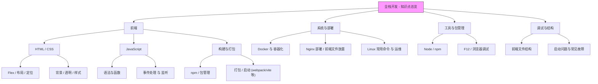

```mermaid
flowchart TB
  root["全栈开发 - 知识点总览"]

  root --> FE["前端"]
  root --> SYS["系统与部署"]
  root --> TOOLS["工具与包管理"]
  root --> DEBUG["调试与结构"]

  FE --> HTMLCSS["HTML / CSS"]
  FE --> JS["JavaScript"]
  FE --> BUILD["构建与打包"]

  HTMLCSS --> Flex["Flex / 布局 / 定位"]
  HTMLCSS --> BG["背景 / 透明 / 样式"]

  JS --> Syntax["语法与函数"]
  JS --> Events["事件处理 与 监听"]

  BUILD --> NPM["npm / 包管理"]
  BUILD --> Bundler["打包 / 启动 (webpack/vite 等)"]

  SYS --> Docker["Docker 与 容器化"]
  SYS --> Nginx["Nginx 部署 / 前端文件放置"]
  SYS --> Linux["Linux 常用命令 与 运维"]

  TOOLS --> Node["Node / npm" ]
  TOOLS --> Devtools["F12 / 浏览器调试" ]

  DEBUG --> FileStructure["前端文件结构"]
  DEBUG --> StartIssues["启动问题与常见故障"]

  %% small layout hints
  classDef rootStyle fill:#f9f,stroke:#333,stroke-width:1px;
  class root rootStyle;
```

> 说明：将此代码块复制到支持 Mermaid 的 Markdown（或 Obsidian）中并渲染。此文件基于目录内标题提取的主题做了概括，如需更细粒度的节点（按每个文件列出小节），告诉我我会生成更详细版本。
![[mermaid-summary 2026-03-29 20.21.20.excalidraw]]